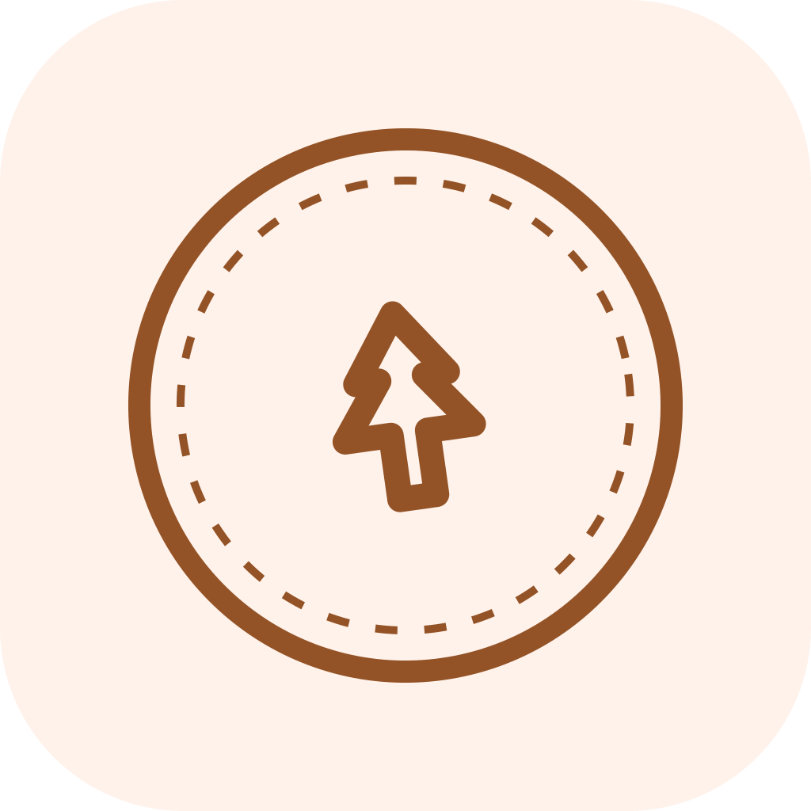
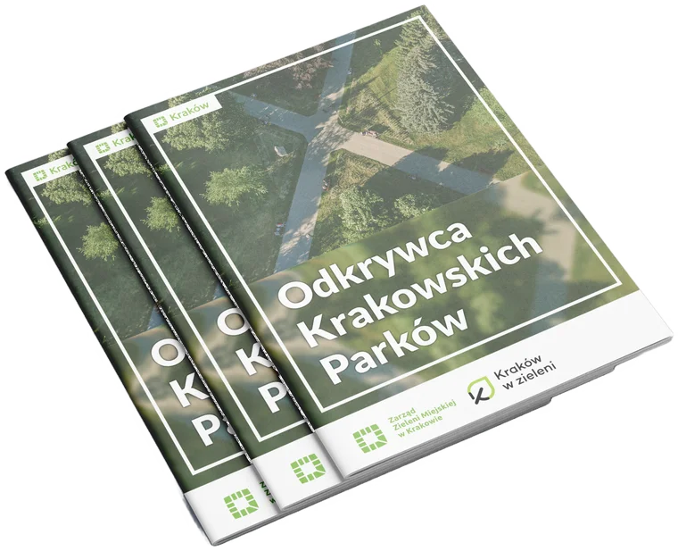
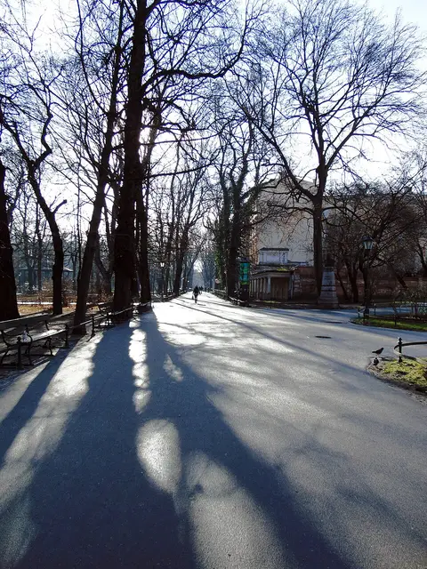
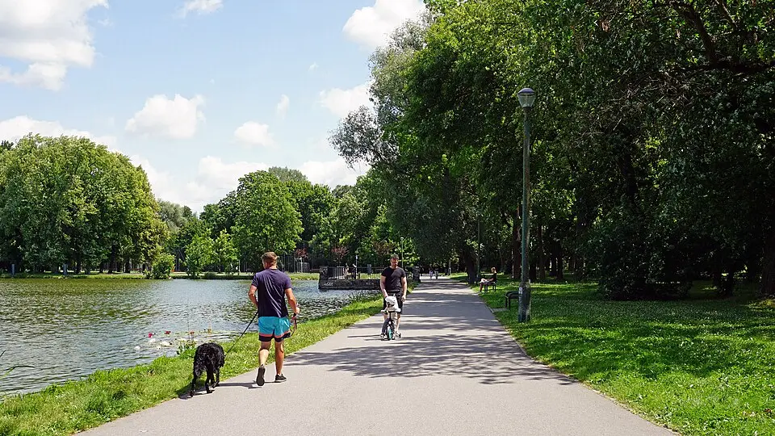
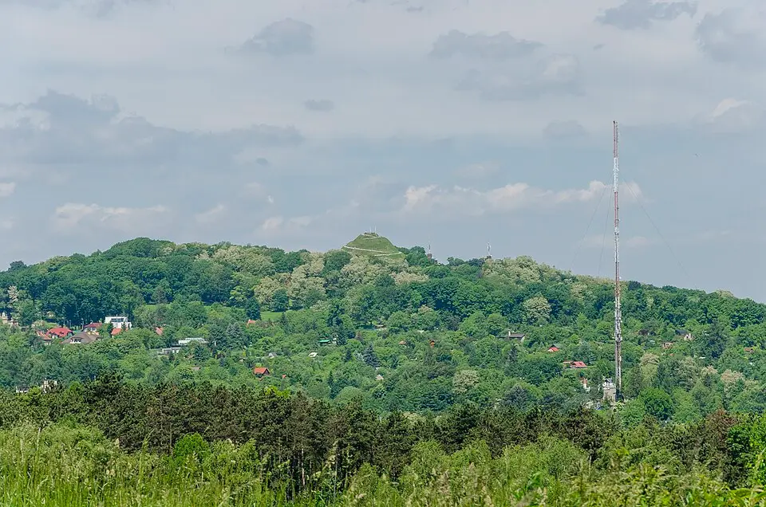
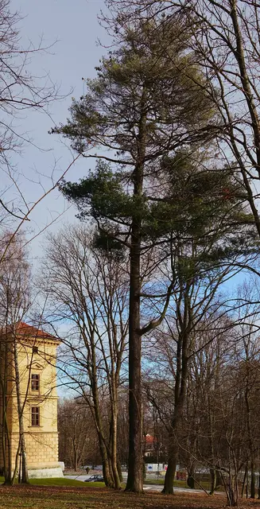
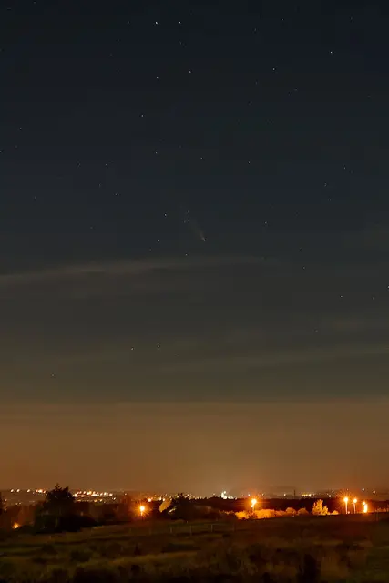
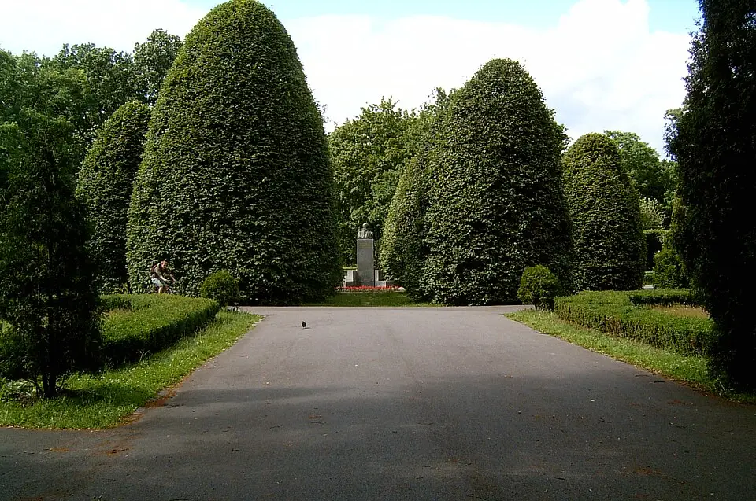

<div align="center">



# Kraków Park Explorer

**A companion app for the *Odkrywca Krakowskich Parków* challenge — 78 parks, 78 hidden stamps, one booklet.**

Offline-first · account-free · free in full · Polski / English

</div>

---

> [!IMPORTANT]
> **This is an unofficial, independent app.** It is not made, endorsed or operated by Zarząd Zieleni Miejskiej w Krakowie (ZZM), and it is not affiliated with them in any way.
>
> **Only a stamp physically pressed into your own paper booklet counts as proof of a visit.** Nothing this app records — check-ins, photos, saved pins, the digital stamp gallery — has any official standing. The app is a planner and a personal diary, not a certificate.

---

## What the challenge is

*Odkrywca Krakowskich Parków* ("Kraków Parks Explorer") is an open-ended city challenge run by ZZM, inspired by peak-bagging in the mountains. You visit 78 designated Kraków parks, find the hidden wooden box in each one, and press its unique rubber stamp into a physical booklet. There is no deadline, no required order and no daily limit. Collect all 78 and you earn the *Odkrywca Krakowskich Parków* badge.

ZZM deliberately does not publish where the boxes are — finding them is the point. This app respects that: it helps you find the *park*, never the *box*.

<div align="center">
  
  <br />
  <em>The official booklet — the only thing that actually counts. Pick one up from ZZM.</em>
</div>

## What the app does

**Explore.** All 78 parks on a map and in a searchable list, colour-coded by category, filterable by distance and by what you've already collected. Each park gets a detail screen with its history, a photo, and how to get there.

**Plan a route.** The headline feature: pick a set of parks — or all your remaining ones — and the app orders them into an efficient trip using a travelling-salesman heuristic, then chunks long routes into day-sized segments. Walking and cycling are supported. Tap Navigate on a leg and your phone's own maps app takes over; there's no turn-by-turn in here.

**Track your booklet.** Mark a park stamped, add memory photos and a private note. Watch the X/78 ring fill, unlock a redrawn digital stamp for every park you collect, earn category badges, and hit celebration moments at 10, 25, 50 and 78.

**Look back.** Personal stats — parks per month, a visit calendar, your longest streak — plus *Parks Wrapped*, which turns your visits and photos into shareable cards. All computed on your device, never compared against anyone else.

<div align="center">
  
  
  
  <br />
  
  
  
</div>

## Principles

The app is **offline-capable and account-free**. There is no sign-up, no login and no server holding your data. Park data, descriptions and all 78 stamp illustrations ship inside the app; your progress, notes and photos live on your device and nowhere else. Route generation is the one feature that reaches the network.

There are **no paid features**, no ads, no analytics tied to you, no leaderboards and no social feed. Location is used in-session for finding nearby parks and planning routes — never tracked in the background without you turning it on.

The digital stamps are **originally redrawn** designs inspired by the challenge's category colours. They are keepsakes, not reproductions of ZZM's stamps.

## Tech

Expo (SDK 57) and React Native, with Expo Router for navigation, Zustand for state, MapLibre over OpenStreetMap tiles for maps, and `react-native-svg` plus core `Animated` for the stamp artwork and motion. Everything ships in Polish and English.

```bash
npm install
npx expo start      # then press i / a, or scan the QR code
```

`npm run ios` and `npm run android` build the native projects directly.

## Attribution

Park data is derived from the official booklet list and enriched from **OpenStreetMap** (© OpenStreetMap contributors, ODbL). Basemap tiles come from OpenFreeMap. Park photographs are credited individually in `assets/parks/attribution.json`, and that credit is displayed in the app on every photo. Fonts are Caprasimo and Figtree via Google Fonts.

If you are ZZM and would like something here changed or removed, please open an issue — it will be actioned.

## Licence

[MIT](LICENSE) © Wojciech Dróżdż. The licence covers this source code; it does not extend to third-party photographs, ZZM's branding, or the official booklet.
